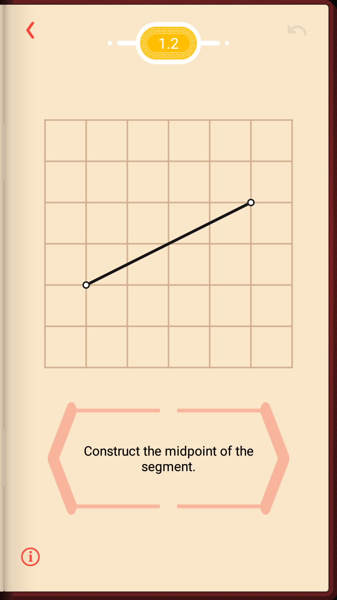
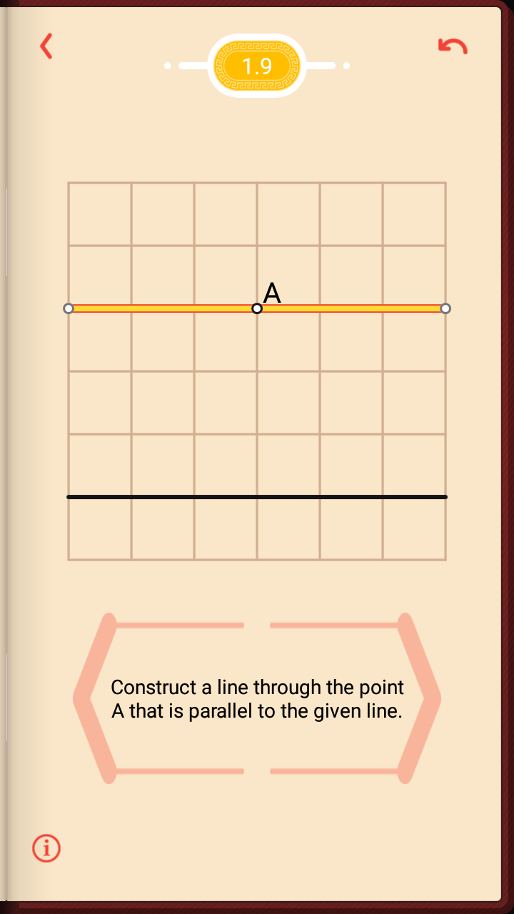
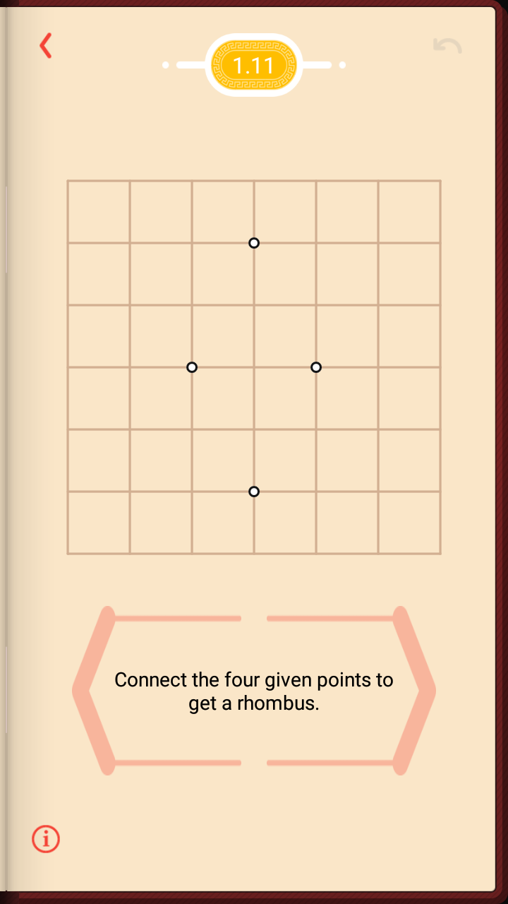
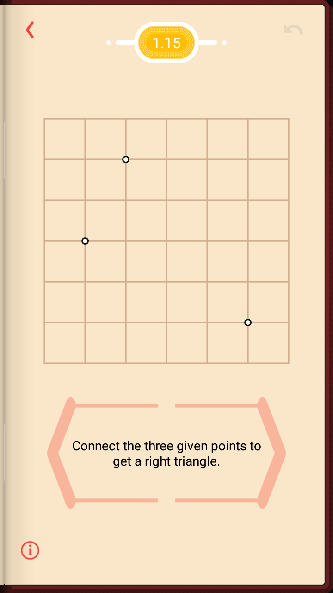

# Pythagorea

## Story

A few days ago, I downloaded a game called **Euclidea** from the recommendation list of Google Play store, which was rated so high as 4.9 out of 5.0. I was suprised how possible a game could reach such a high score. After installation, I would say I've already fallen in love with it at the moment I started the first stage in the first level.

Basically, the game needs you to construct some figure using only a limited tools such as ruler and compass. It is like compass and straightedge construction in mathematics. But the game isn't that easy as it looks and sounds. Because it asks you to complete the construction in minimum steps to clear the stage, which, actually, imposes a more strict restriction than mathematically construction. And sometimes you have to think over for more than one way to complete the same construction in order to dig out the hidden star.

Compass and straightedge construction is so elementary that is taught to every young student of school age. But one may never touch it when left school and thus may never find the construction could do more beyond imagination. Fortunately, his game provides a very good opportunity for everyone to refresh the knowledge of and re-think about compass and straightedge construction. Completed a construction, you know not only how to do it but also why this way works.

So I become addicted to it very soon. I obtain all stars, including hidden ones, in the first level. But the game also grows tough in the new level. Interestingly, at one time I accidently complete the construction. I didn't know how but I really did it. Then I repeated it again and again but I've been never found a proof of my construction.

When I was trapped, I opened Google Play store again and found out another game made by the same coorporation as Euclidea, which is named **Pythagorea** and rated 4.8. Pythagorea, having simililar idea with Euclidea, reduces tools of construction. You can only draw lines and intersections, but a square grid is given so that some fixed quantities can also be drawn according to Pythagorean theorem and symmetry. This game is also very addictive but less difficult than Euclidea.

As a result, I completed all stages and levels in less than 20 hours. So I want to share my solutions here as a reference for whomever wants to know how and why. I hope this helps for study of the beautiful classic geometry. 

## Download Link

[Official website](http://www.euclidea.xyz/)

## How to use

For the moment, I sort all levels and stages in the order as in the game. Later, I consider to sort by the construction category of the problem. I will also offer proofs to some no-obvious constructions. 

Please do not just copy the answer, the action will definitely lost the fun and the value of this game. I also hope somebody finding a better solution tell me and share the enjoyness.

## Status

Sep. 3, 2016 Updates level Elementary

## Problems and Solutions

### 

### Elementary

* Construct a line segment that connects the two points.
 

* Construct the midpoint of the segement.
 

* connect the four given points to get a square.
 

* Construct a square using the given segement as a side.
 

* Construct a line through the point A that is perpendicular to the given ine.
 

* Connect the four given points to get a rectangle.
 

* Construct a rectangle whose three of four vertices are given.
 

* Construct the midpoint of the segement.
 

* Construct a line through the point A that is parallel to the given line.
 

* Select a pair of parallel lines.
 

* Connect the four given points to get a rhombus.
 

* Construct a rhombus whose three of four vertices are given.
 

* Construct two points that divide the segement into three equal parts.
 

* Select a pair of perpendicular lines.
 

* Connect the three given points to get a right triangle.
 

* Construct a square using the given segement as a side.
 

* Construct the center of the circle.
 

* Construct a line through the point A that is parallel to the given line.
 

* Construct a line at distance 3 from the given one.
 

* Select all nodes at distance 2 from the point A.
 

* Connect the three given points to get an isosceles triangle.
 

* Construct an isosceles triangle whose vertices are three of the given points.
 

* Construct an angle bisector.
 

* Construct all three mid-segments of the triangle.
 

### Very Easy

*Construct two points that divide the segement into three equal parts.
 

### 